# 🛰️ LAB 3 – Observation du trafic HTTP(S) Android avec Burp Suite

<p align="center">
  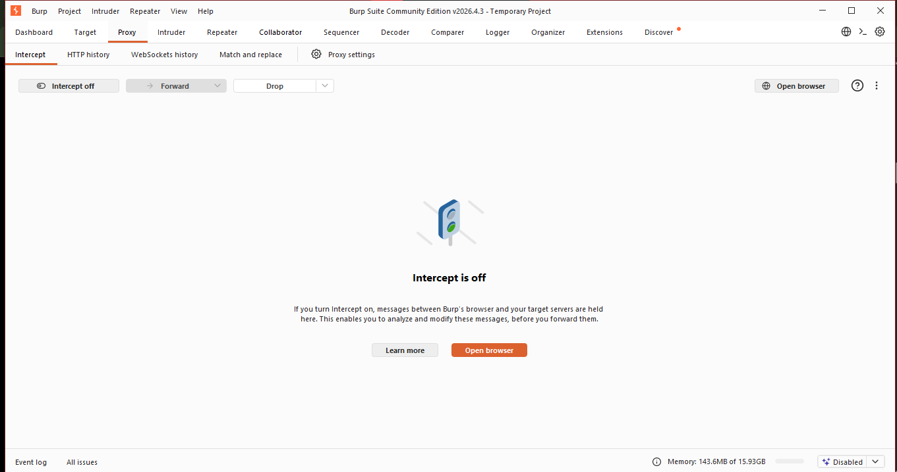
</p>

<p align="center">
  
  
  
  
</p>

---

## 🎯 Objectif général

Ce laboratoire consiste à mettre en place un **proxy d’observation** entre un **Android Emulator** et une **cible HTTP autorisée**, afin d’analyser le trafic généré depuis le navigateur Android à travers **Burp Suite Community Edition**.

L’objectif n’est pas de modifier ou d’attaquer une application, mais de comprendre comment un proxy s’insère dans le chemin réseau et comment un analyste peut lire proprement une requête HTTP.

---

## 🧭 Vue rapide du lab

| Élément | Résultat |
|---|---|
| Proxy Burp actif | ✅ Validé |
| Android configuré avec proxy | ✅ Validé |
| Cible locale autorisée | ✅ Validé |
| Requête GET capturée | ✅ Validé |
| Requête POST capturée | ✅ Validé |
| Cookies observés | ✅ Validé |
| Interception contrôlée | ✅ Validé |
| Principe certificat CA | ✅ Étudié |
| Nettoyage final | ✅ Réalisé |

---

## 🧱 Architecture du laboratoire

```text
┌──────────────────────┐
│  Android Emulator    │
│  Navigateur Android  │
└──────────┬───────────┘
           │
           │ Trafic HTTP redirigé
           ▼
┌──────────────────────┐
│      Burp Suite      │
│   Proxy 10.0.2.2:8080│
└──────────┬───────────┘
           │
           │ Requêtes observées
           ▼
┌──────────────────────┐
│ Mini serveur Python  │
│ 192.168.43.182:8000  │
└──────────────────────┘
```

---

## 🧪 Environnement utilisé

| Composant | Configuration |
|---|---|
| Machine hôte | Windows |
| Proxy | Burp Suite Community Edition |
| Version Burp observée | `v2026.4` |
| Appareil de test | Android Emulator |
| Réseau Android | AndroidWifi |
| Proxy côté Android | `10.0.2.2:8080` |
| Listener Burp côté hôte | `127.0.0.1:8080` |
| Cible locale | `http://192.168.43.182:8000` |
| Script serveur | `target/demo_server.py` |
| Type de trafic analysé | HTTP |
| Données sensibles | Aucune |

---

## 🔐 Règles de sécurité appliquées

Ce lab a été réalisé uniquement dans un environnement contrôlé.

| Règle | Application dans ce lab |
|---|---|
| Cible autorisée uniquement | Mini serveur local Python |
| Aucun compte personnel | Aucun login utilisé |
| Aucune donnée sensible | Données de démonstration uniquement |
| Pas de modification agressive | Requêtes observées seulement |
| Certificat CA | Non installé définitivement |
| Nettoyage final | Proxy supprimé à la fin |

> Ce laboratoire est limité à un usage pédagogique dans un environnement de test.

---

# 1. Préparation de la cible locale

## 🚀 Lancement du mini serveur HTTP

Une cible locale a été créée avec Python afin de disposer d’un environnement simple, reproductible et autorisé.

Commande utilisée :

```powershell
cd C:\Users\Microsoft\Documents\LAB3_Burp_Android
python .\target\demo_server.py
```

Preuve du lancement :

<p align="center">
  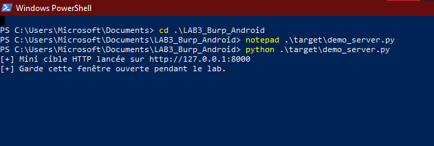
</p>

Le serveur expose :

| Fonction | Description |
|---|---|
| Page principale | Interface de test HTTP |
| Formulaire GET | Envoi de paramètres dans l’URL |
| Formulaire POST | Envoi de données dans le corps |
| Cookies | Cookies de démonstration |
| Réponses HTTP | Réponses simples en `200 OK` |

---

# 2. Configuration de Burp Suite

## ⚙️ Lancement de Burp

Burp Suite a été lancé avec un projet temporaire de laboratoire.

<p align="center">
  
</p>

Au début du test, l’interception a été laissée désactivée afin de ne pas bloquer la navigation.

---

## 📡 Vérification du Proxy Listener

Le listener Burp a été vérifié dans :

```text
Settings → Tools → Proxy → Proxy listeners
```

<p align="center">
  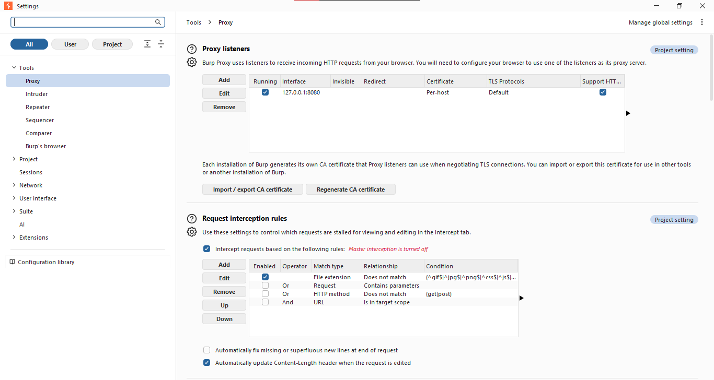
</p>

Configuration observée :

| Paramètre | Valeur |
|---|---|
| État | Running |
| Interface | `127.0.0.1:8080` |
| Port | `8080` |
| Certificat | Per-host |
| Support HTTP | Activé |

Cette étape confirme que Burp est prêt à recevoir du trafic HTTP via le port `8080`.

---

# 3. Configuration du proxy Android

## 📱 Proxy Wi-Fi manuel

Dans l’émulateur Android, le proxy du réseau `AndroidWifi` a été configuré en mode manuel.

<p align="center">
  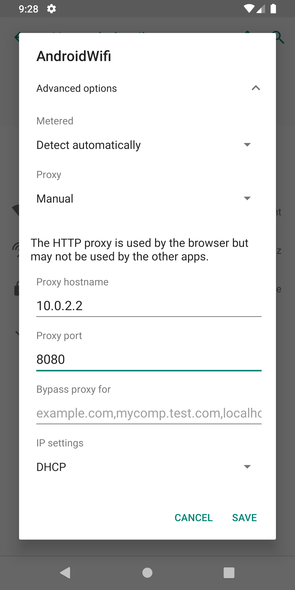
</p>

Configuration appliquée :

| Paramètre | Valeur |
|---|---|
| Proxy | Manual |
| Hostname | `10.0.2.2` |
| Port | `8080` |
| IP settings | DHCP |

---

## 🧩 Validation avec `http://burp`

Une première vérification a été faite avec :

```text
http://burp
```

<p align="center">
  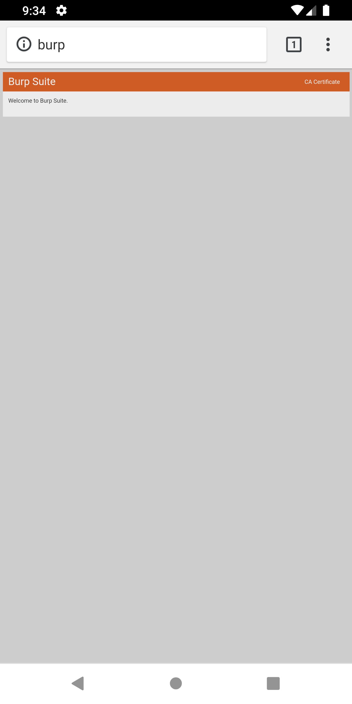
</p>

Cette page confirme que le navigateur Android peut atteindre l’interface du proxy Burp.

---

## 🛠️ Stabilisation du proxy via ADB

Pendant le lab, le trafic ne passait plus toujours par Burp après certaines manipulations.  
Le proxy global Android a donc été forcé via ADB.

Commande utilisée :

```powershell
adb -s emulator-5554 shell settings put global http_proxy 10.0.2.2:8080
adb -s emulator-5554 shell settings get global http_proxy
```

Résultat attendu :

```text
10.0.2.2:8080
```

Cette correction a permis de garantir que le trafic HTTP du navigateur Android passe bien par Burp Suite.

---

# 4. Validation de la capture HTTP

## 🌐 Accès à la cible locale depuis Android

La cible locale a été ouverte depuis le navigateur Android :

```text
http://192.168.43.182:8000
```

<p align="center">
  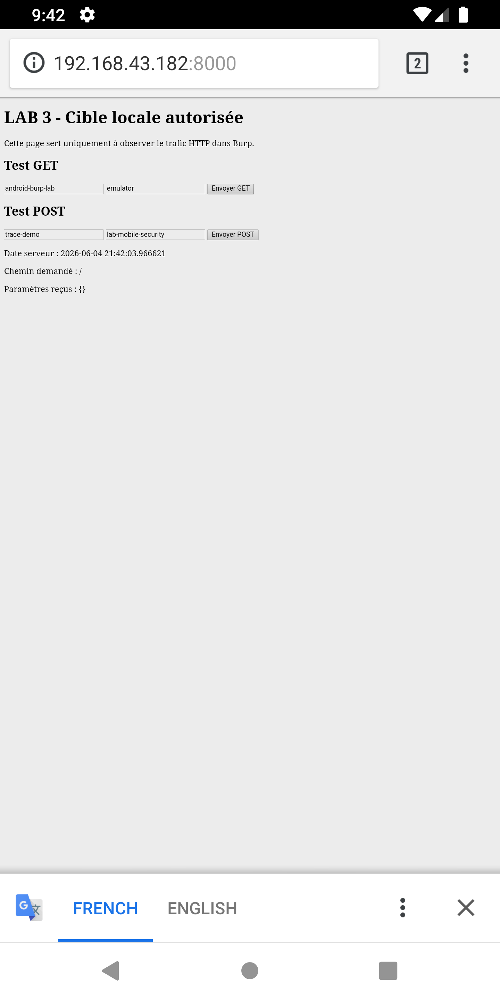
</p>

La page de test s’affiche correctement, ce qui confirme que le serveur local est accessible depuis l’émulateur.

---

## 📜 Apparition des requêtes dans Burp

Dans Burp, les requêtes apparaissent dans :

```text
Proxy → HTTP history
```

<p align="center">
  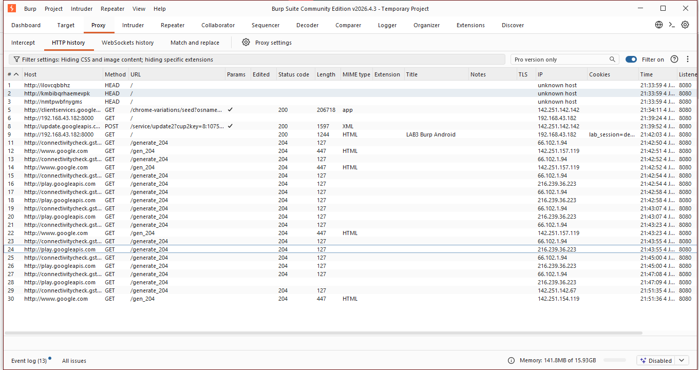
</p>

Observation :

| Élément | Valeur |
|---|---|
| Host | `192.168.43.182:8000` |
| Méthode | GET |
| Statut | `200 OK` |
| MIME type | HTML |
| Cookie | `lab_session=demo_cookie_123` |

Cette étape valide la chaîne complète :

```text
Android Emulator → Burp Suite → Mini serveur local
```

---

# 5. Analyse d’une requête GET

## 🟢 Génération de la requête GET

Le bouton `Envoyer GET` a été utilisé depuis la page locale.

<p align="center">
  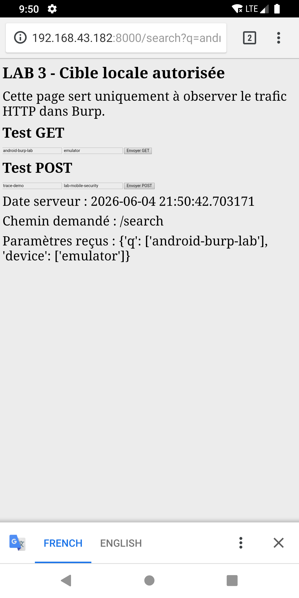
</p>

La requête générée contient des paramètres directement dans l’URL :

```http
GET /search?q=android-burp-lab&device=emulator HTTP/1.1
```

---

## 🔎 Requête GET dans Burp

<p align="center">
  
</p>

Vue Raw :

<p align="center">
  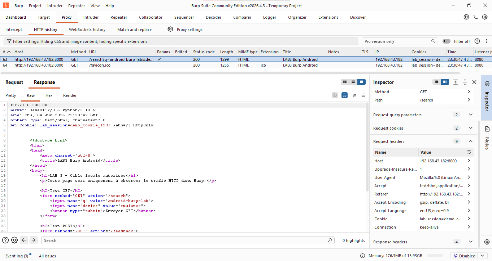
</p>

Analyse de la requête :

| Élément | Observation |
|---|---|
| Méthode | GET |
| Chemin | `/search` |
| Paramètre `q` | `android-burp-lab` |
| Paramètre `device` | `emulator` |
| Hôte | `192.168.43.182:8000` |
| Cookie | `lab_session=demo_cookie_123` |

> Les paramètres GET sont visibles directement dans l’URL.  
> Cela signifie que les données envoyées en GET apparaissent clairement dans le chemin de la requête HTTP.

---

## 🧠 Lecture structurée avec Inspector

Burp Inspector permet de lire la requête de manière plus organisée.

<p align="center">
  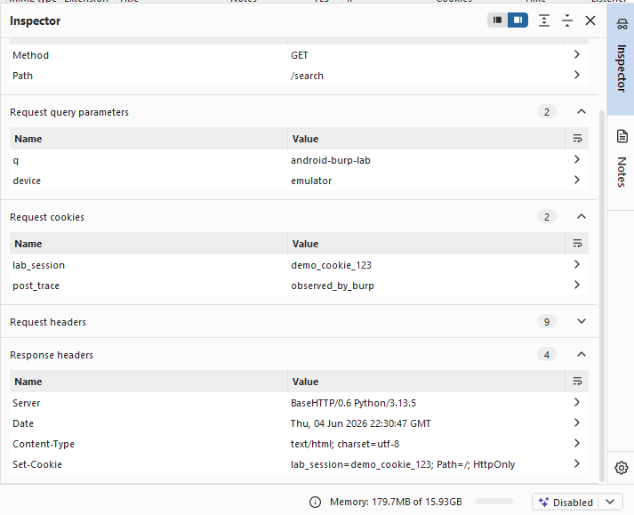
</p>

Éléments observables :

| Zone Inspector | Utilité |
|---|---|
| Query parameters | Liste des paramètres GET |
| Request headers | En-têtes HTTP |
| Request cookies | Cookies transmis |
| Request attributes | Informations générales |

---

# 6. Analyse d’une requête POST

## 🟠 Génération de la requête POST

Le bouton `Envoyer POST` a été utilisé pour envoyer un formulaire vers `/feedback`.

<p align="center">
  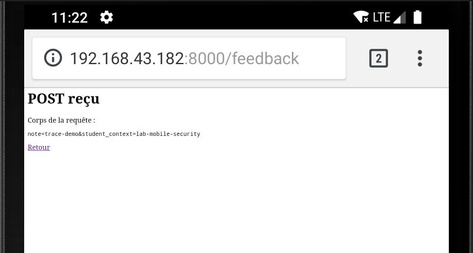
</p>

Le serveur affiche le corps reçu :

```text
note=trace-demo&student_context=lab-mobile-security
```

---

## 📥 Requête POST dans Burp

<p align="center">
  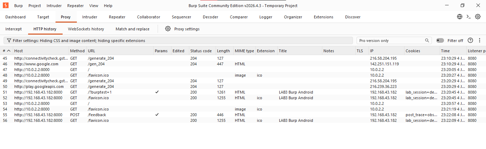
</p>

Vue Raw :

<p align="center">
  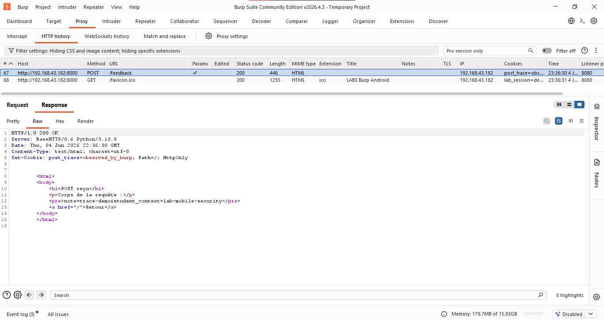
</p>

Analyse de la requête :

| Élément | Observation |
|---|---|
| Méthode | POST |
| Chemin | `/feedback` |
| Content-Type | `application/x-www-form-urlencoded` |
| Body | `note=trace-demo&student_context=lab-mobile-security` |
| Code réponse | `200 OK` |

> Contrairement à GET, les données POST ne sont pas placées directement dans l’URL.  
> Elles sont envoyées dans le corps de la requête HTTP.

---

## 🧬 POST dans Inspector

<p align="center">
  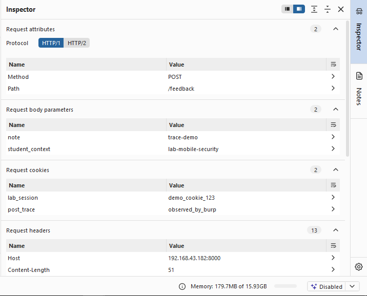
</p>

<p align="center">
  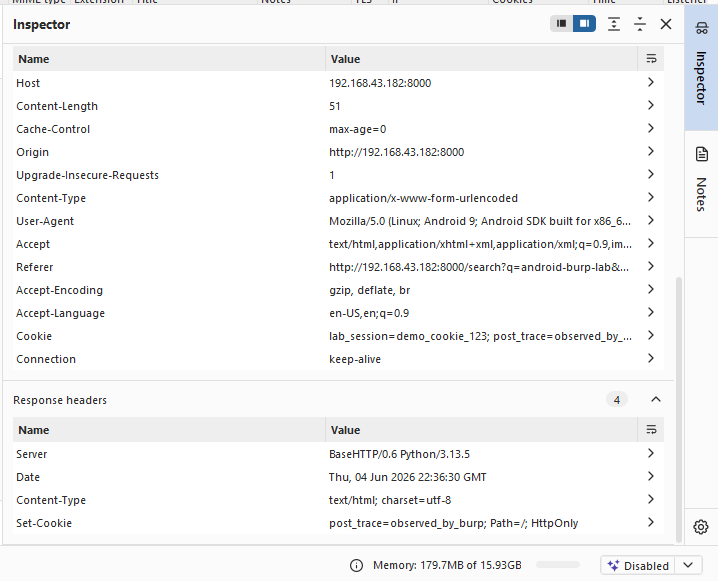
</p>

Observation :

> POST permet de transporter les données dans le corps de la requête, mais cela ne rend pas automatiquement les données confidentielles.  
> En HTTP simple, Burp peut toujours lire le contenu transmis.

---

# 7. Comparaison GET vs POST

| Critère | GET | POST |
|---|---|---|
| Emplacement des données | URL | Corps de la requête |
| Visibilité dans Burp | Très directe | Visible dans le body |
| Exemple observé | `/search?q=...&device=...` | `note=...&student_context=...` |
| Cas d’usage | Lecture / recherche | Formulaire / envoi de données |
| Protection en HTTP | Non | Non |

> GET et POST ne chiffrent pas les données.  
> La protection dépend du protocole utilisé, notamment HTTPS.

---

# 8. Interception contrôlée

## ⏸️ Activation temporaire de l’interception

Après l’observation passive, l’interception a été activée brièvement.

<p align="center">
  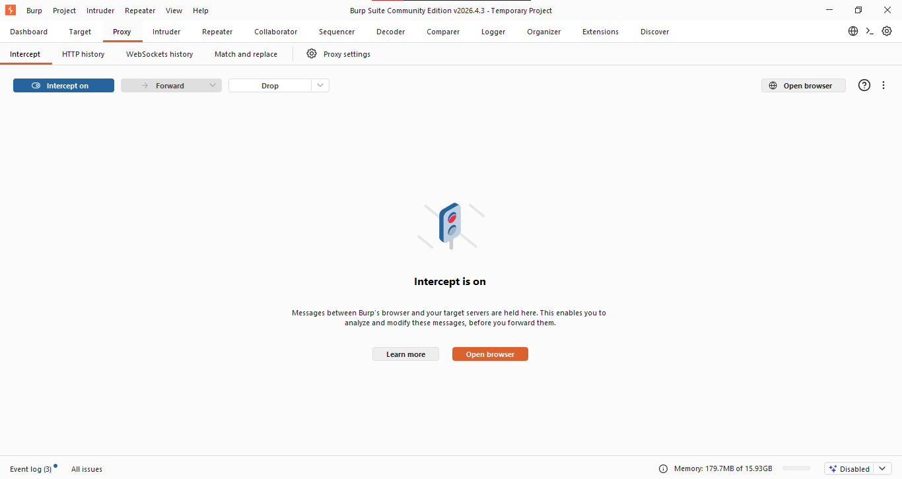
</p>

Une nouvelle requête a été déclenchée depuis Android :

```text
http://192.168.43.182:8000/?intercept_demo=222
```

Côté Android, la navigation attend une réponse car Burp retient la requête.

<p align="center">
  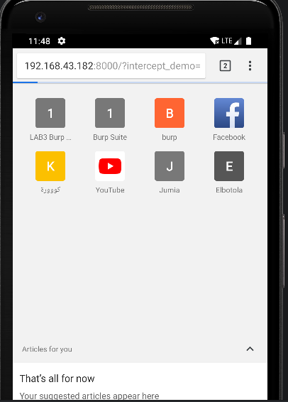
</p>

---

## 🧲 Requête retenue dans Burp

<p align="center">
  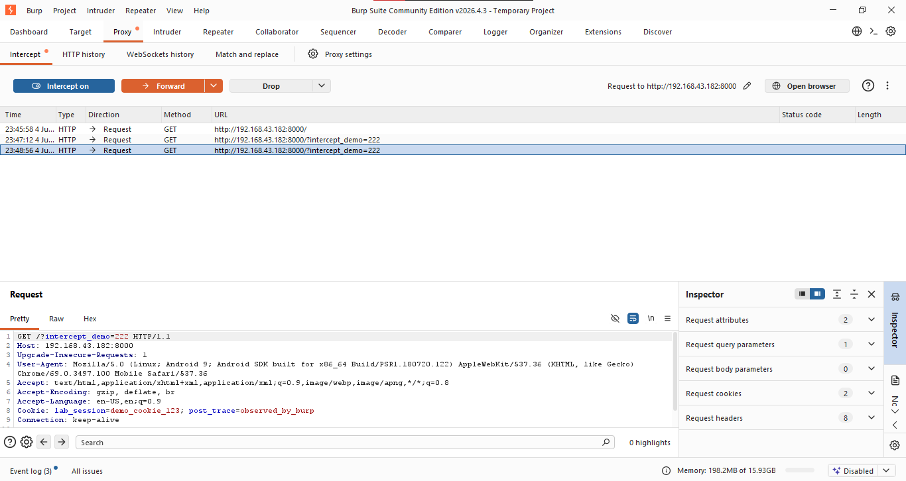
</p>

Requête observée :

```http
GET /?intercept_demo=222 HTTP/1.1
Host: 192.168.43.182:8000
User-Agent: Mozilla/5.0 ...
Cookie: lab_session=demo_cookie_123; post_trace=observed_by_burp
```

Cette étape montre que Burp devient un point de passage actif.

---

## ▶️ Forward et désactivation

La requête a été transmise avec `Forward`.

<p align="center">
  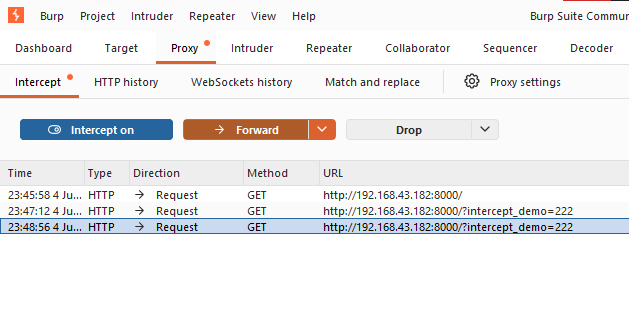
</p>

Puis l’interception a été désactivée.

<p align="center">
  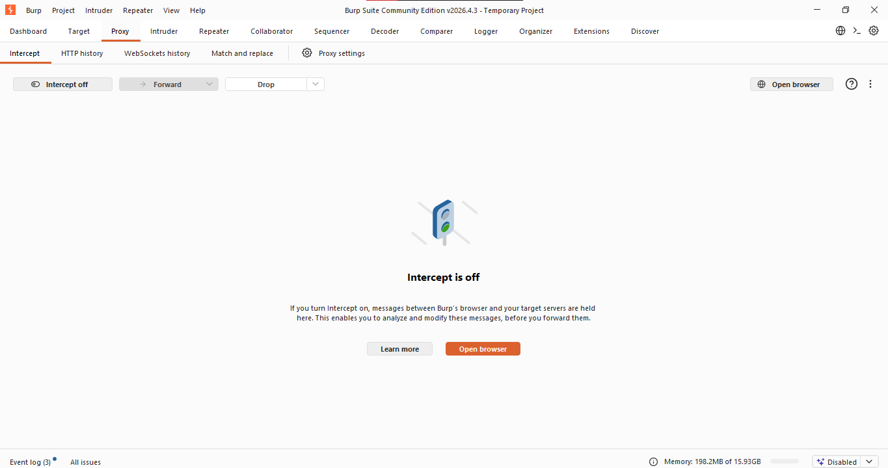
</p>

Aucune modification n’a été effectuée.

---

# 9. HTTPS et certificat CA

## 🔐 Principe

HTTPS protège les échanges grâce au chiffrement TLS et à la vérification de l’identité du serveur.

Pour observer du trafic HTTPS en laboratoire, Burp Suite peut utiliser une autorité de certification locale.  
L’émulateur Android doit alors faire confiance au certificat CA de Burp.

---

## 🧾 Certificat CA côté Burp

<p align="center">
  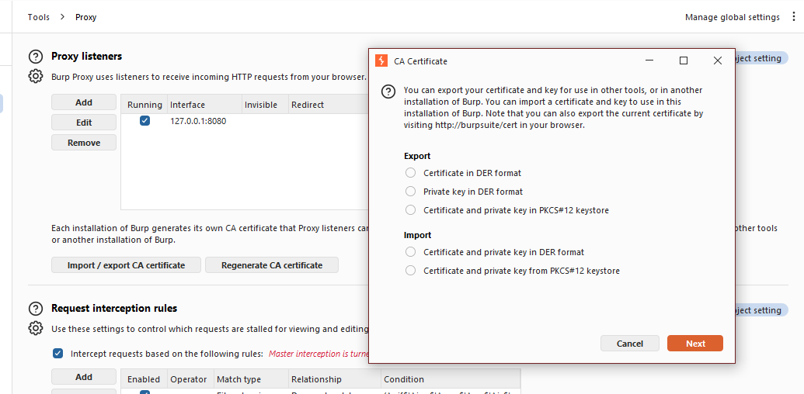
</p>

Burp propose plusieurs formats d’export :

| Option | Usage |
|---|---|
| Certificate in DER format | Export simple du certificat |
| Private key in DER format | Export de clé privée |
| PKCS#12 keystore | Certificat + clé dans un conteneur |

---

## 📱 Gestion des certificats côté Android

<p align="center">
  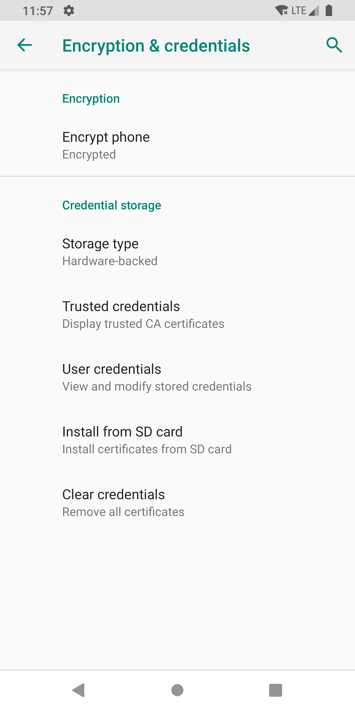
</p>

Dans ce lab, le certificat CA n’a pas été installé définitivement.

> Un certificat CA de laboratoire augmente la capacité d’observation du trafic.  
> Il doit rester limité à un émulateur de test et être supprimé après usage.

---

# 10. Nettoyage final

## 🧹 Suppression du proxy ADB

À la fin du lab, le proxy global Android a été réinitialisé.

Commande :

```powershell
adb -s emulator-5554 shell settings put global http_proxy :0
adb -s emulator-5554 shell settings get global http_proxy
```

Résultat obtenu :

```text
:0
```

Preuve :

<p align="center">
  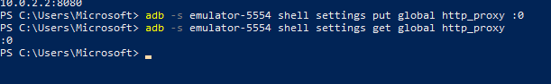
</p>

---

## 📶 Proxy Wi-Fi remis à None

<p align="center">
  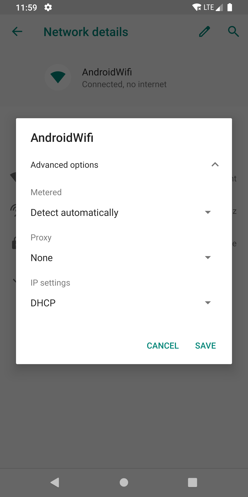
</p>

L’émulateur a été remis dans un état propre afin d’éviter que les prochaines navigations passent encore par Burp.

---

# 11. Difficulté rencontrée

Pendant le lab, une difficulté a été observée :

```text
Le serveur local recevait bien les requêtes, mais Burp ne les affichait plus dans HTTP history.
```

Diagnostic :

| Observation | Interprétation |
|---|---|
| Le serveur Python recevait les requêtes | Android atteignait bien la cible |
| Burp ne voyait plus le trafic | Le navigateur ne passait plus par le proxy |
| `http://10.0.2.2:8000` fonctionnait | Accès direct à la cible |
| `HTTP history` vide | Proxy non utilisé correctement |

Correction appliquée :

```powershell
adb -s emulator-5554 shell settings put global http_proxy 10.0.2.2:8080
```

Après cette correction, Burp a bien capturé les requêtes GET et POST.

---

# 12. Bilan final

| Contrôle | Résultat |
|---|---|
| Burp lancé | ✅ |
| Proxy Listener actif | ✅ |
| Serveur local lancé | ✅ |
| Proxy Android configuré | ✅ |
| Proxy forcé via ADB | ✅ |
| GET capturé | ✅ |
| POST capturé | ✅ |
| Cookies observés | ✅ |
| Inspector utilisé | ✅ |
| Interception contrôlée | ✅ |
| Certificat CA étudié | ✅ |
| Nettoyage final | ✅ |

---

# 13. Conclusion

Ce lab a permis de comprendre comment Burp Suite peut être utilisé comme proxy d’observation entre un navigateur Android et une cible locale autorisée.

Les captures dans `HTTP history` ont montré les méthodes HTTP, les URL, les en-têtes, les cookies et les paramètres transmis.

L’analyse de GET et POST a permis de distinguer :

- les paramètres visibles dans l’URL ;
- les données transmises dans le corps de la requête ;
- le rôle des cookies ;
- l’importance du contexte dans une trace d’audit.

L’interception contrôlée a démontré que Burp peut retenir temporairement une requête avant de la transmettre au serveur.

La partie HTTPS a permis de comprendre le rôle du certificat CA dans un environnement d’analyse TLS.

Le nettoyage final a permis de remettre l’émulateur dans un état sain.

---

# 14. Structure du projet

```text
LAB3_Burp_Android/
│
├── README.md
│
├── screenshots/
│   ├── Android_proxy_manual.png
│   ├── Android_WiFi.png
│   ├── Burp_CA-certificate.png
│   ├── Burp_launch.png
│   ├── Burp_new-request_intercept_on.png
│   ├── burp_proxy_listener.png
│   ├── forward_newrequest.png
│   ├── GET.png
│   ├── GET_burp.png
│   ├── GET_inspector_more.png
│   ├── GET_raw.png
│   ├── host_ip-addr.png
│   ├── http_burp.png
│   ├── http_hostip.png
│   ├── Install_certificate.png
│   ├── intercept_off_after_forwarding.png
│   ├── Intercept_on.png
│   ├── lancement_serveur_minicible_http.png
│   ├── nettoyage_emulator_pshell.png
│   ├── nettoyage_proxy_none.png
│   ├── new-request_intercept_on.png
│   ├── POST.png
│   ├── POST_burp.png
│   ├── POST_Inspector1.png
│   ├── POST_Inspector2.png
│   └── POST_raw.png
│
└── target/
    └── demo_server.py
```

---

<p align="center">
  <b>LAB 3 terminé avec succès ✅</b><br>
  Observation HTTP Android · Burp Suite · Analyse GET/POST · Interception contrôlée
</p>
